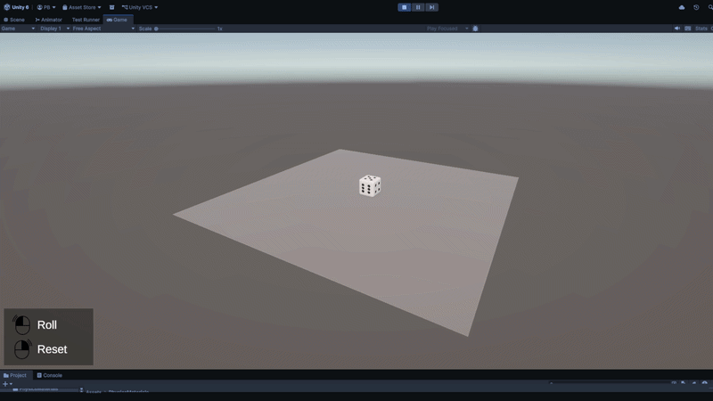
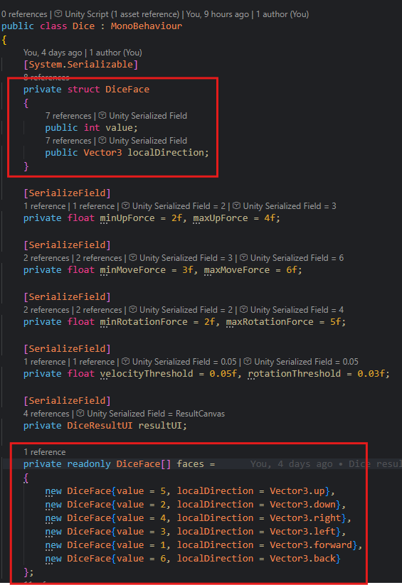
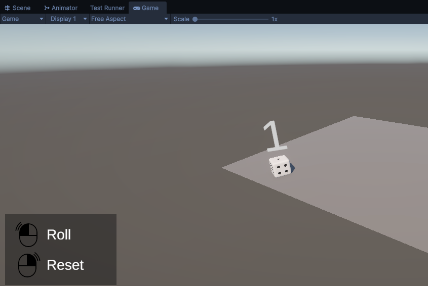
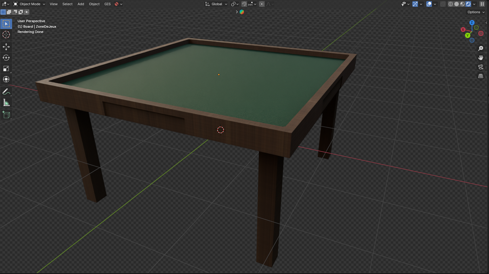
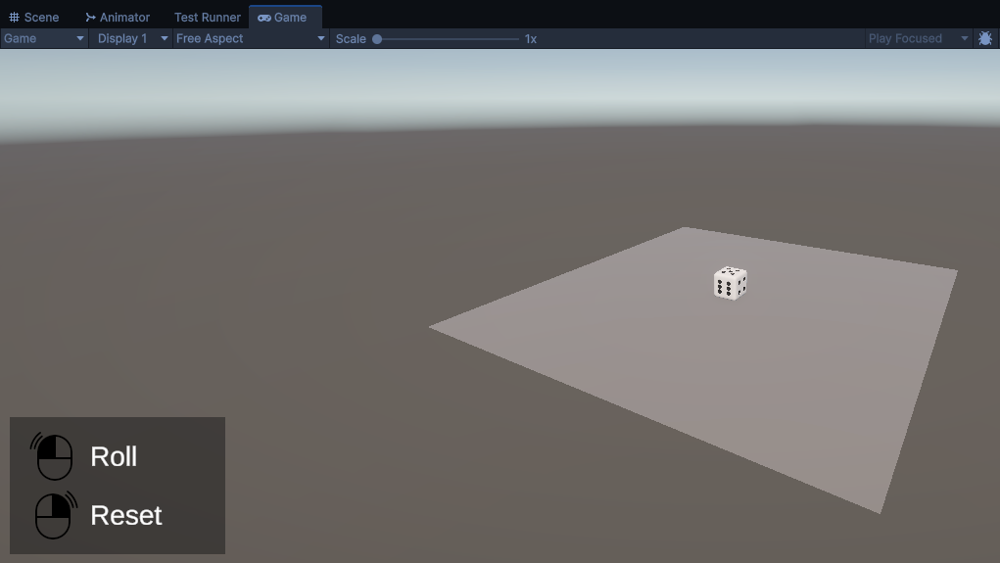

# 3D Dice Task

## Overview

This project consists of creating an interactive 3D dice in Unity, capable of being rolled using the engine's physics system, automatically detecting the resulting face, and displaying the result above the dice.

---

## 3D Model

I chose to use a free 3D dice model downloaded from Sketchfab.

Since each face is clearly distinguishable, it also made the result detection phase easier to implement.

---

## Rolling Mechanic

To simulate the dice roll, I chose to use three distinct forces:

* **Up Force**: acts on the **Y axis** and allows the dice to leave the ground.
* **Move Force**: acts on the **X and Z axes**, giving direction to the throw and allowing the dice to travel across the scene.
* **Rotation Force**: applies rotational movement to prevent simple sliding and create a more natural roll.

For each of these forces, a random value is selected between a predefined minimum and maximum range, making every roll slightly different.

---

## Face Detection

The first approach I considered was placing a **Sphere Collider** on each face of the dice using **Trigger mode**, in order to detect which face was pointing upward.
This method had the advantage of being simple to understand and quick to implement.

I ultimately chose the **Face Normals** approach, as it better matches the task requirements and provides a more robust solution.

To achieve this:

* a `DiceFace` structure associates a value with a local direction;
* an array stores all of these associations;
* each local direction is converted into world space;
* that direction is compared against the global up vector to determine which face is most aligned upward.

This approach allows the rolled value to be determined reliably.

---

## Result Display

The result is displayed above the dice using a **World Space Canvas** with **TextMeshPro**.

The text:

* only appears once the roll is finished;
* follows the dice position;
* always faces the camera to remain readable at all times.

---

## Scene Setup

My initial idea was to create a more immersive environment, similar to a real dice rolling tray.

I first considered downloading a 3D table or tray model. Since I could not find a satisfying free asset, I attempted to model one myself in Blender.

However, I ran into material import issues: Unity and Blender do not handle certain material systems in the same way, which led to several rendering incompatibilities.

I tested multiple alternatives:

* baked texture exports;
* normal maps;
* different export workflows.

Without satisfying results, I decided to return to a simpler setup while staying faithful to the original task requirements:

* a simple ground plane;
* a camera centered on the scene;
* invisible walls to prevent the dice from falling out of bounds.

Since the dice could sometimes get stuck in corners or stabilize on an edge, I added invisible corner columns to soften collisions.

While not the most elegant technical solution, it proved to be simple and effective.

---

## Controls

* **Left Click** → Roll the dice
* **Right Click** → Reset the dice

A small UI hint was also added in the bottom-left corner to clearly indicate the controls.

Additionally, rolling is disabled while a roll is already in progress in order to prevent inconsistent behavior.

---

# Challenges Encountered

## Dice Physics Tuning

One of the main difficulties was achieving believable physical behavior.

During development, the dice would sometimes:

* stabilize on an edge;
* land in unrealistic positions;
* produce collisions leading to inconsistent results.

This required a fair amount of iteration and tuning across several physics-related parameters:

* Physics Materials;
* Collider setup;
* Rigidbody settings;
* applied rolling forces;
* scene dimensions.

This iterative process significantly improved the overall behavior.

That said, the result is still not perfect: it feels closer to a well-behaved video game dice than a true real-world dice throw.

---

## Achieving a Realistic Roll

The three-force rolling system works well overall, but achieving a truly natural roll proved more complex than expected.

The main challenge was finding the right balance between:

* throw height;
* horizontal movement;
* rotational force;
* friction;
* bounce.

A slight change in one parameter can dramatically affect the final result:

* too much rotation → spinning top effect;
* too little rotation → sliding behavior;
* too much vertical force → unrealistic jump;
* too little vertical force → flat throw.

After multiple iterations, I kept this approach because it remained the simplest, clearest, and most consistent with Unity's built-in physics system.

---

## Randomness and Inconsistent Cases

Using randomized values for each roll naturally adds variety, making the experience feel more dynamic.

However, it also introduces rare but inconsistent edge cases:

* unnatural rolls;
* unexpected physics behavior;
* situations that are difficult to reproduce.

These issues are particularly difficult to debug because they can occur very occasionally, sometimes only after many rolls.

---

## Scene Size

Scene size also has a strong impact on the perceived quality of the roll.

With a larger play area:

* the dice has more room to roll naturally;
* it collides less often with boundaries;
* it is less likely to get stuck in corners.

However, this introduces visual drawbacks.

A larger scene would have required:

* either a dynamic camera following the dice;
* or a much wider framing.

I preferred keeping a more compact scene with a diagonal camera angle that captures the entire action at all times.

This choice favors readability and presentation, at the cost of having a smaller simulation space.
